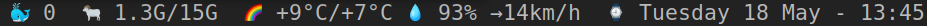

# dwmblocks

Modular status bar for dwm.

## docker

Displays running docker containers

## ram usage

Shows used/available ram

## weather

Displays weather data with format

Actual/Feels like
Humidity
Wind speed

## clock

a clock :-)
